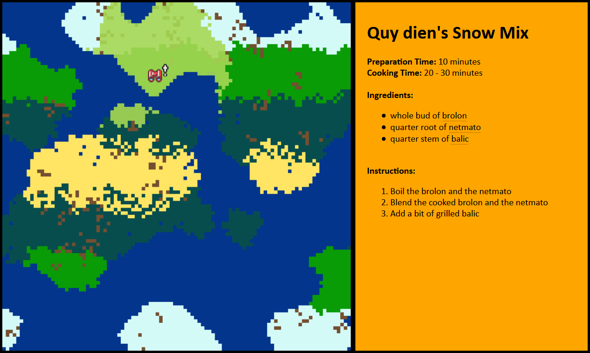

# *Cuisine du Monde* -- The Recipe-ography Machine

_A recipe generator, embedded within a generated world, with generated ingredients._

## Installing instructions
1. You'll need Python, with pip installed
2. Download and extract the repository, or clone it with Git
3. Open the command prompt and navigate to the folder
4. Install the Perlin Noise dependency with `pip install perlin-noise`

## How to run
1. To generate a new world, execute the `Assembler.py` file in the root folder
2. Wait until the script is done running (about 20 seconds)
3. To explore the new generated world, navigate to `/webviewer` and open `index.html`

